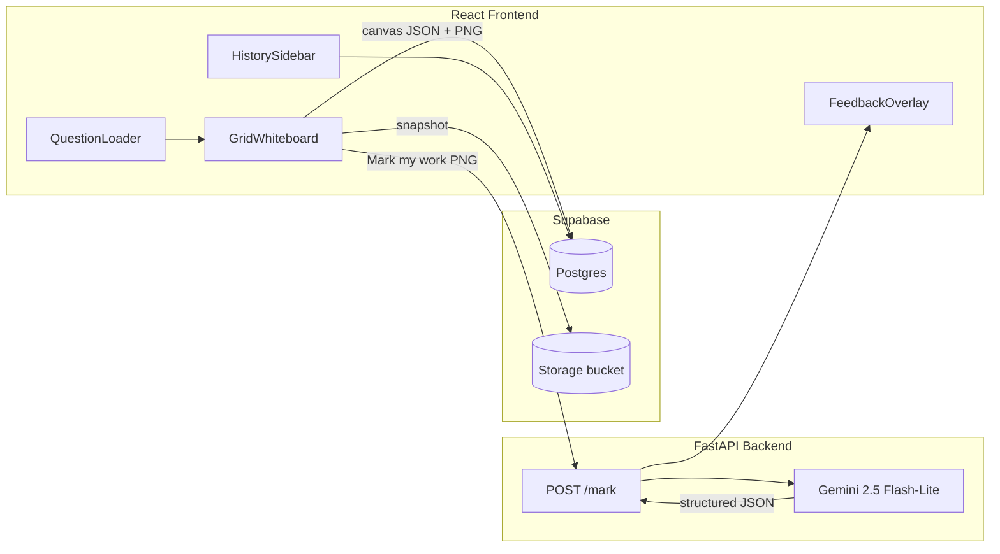
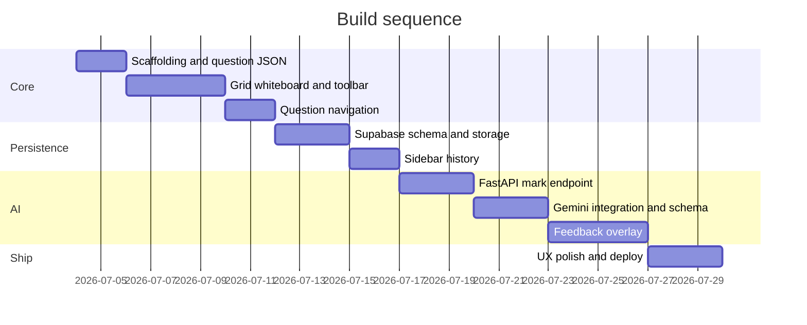

# A-Level Maths Tutor App — Implementation Plan

## Context

LeafProject26 is effectively empty (README + LICENSE only). This is a **greenfield build**.

Confirmed choices:

- **Auth:** anonymous browser session (UUID in `localStorage`; no login)
- **Questions:** static JSON files bundled with the frontend

---

## High-level architecture



**Data flow on “Mark my work”:**

1. Export whiteboard canvas → PNG (working area only, with grid if desired).
2. FastAPI receives `{ session_id, question_id, question_text, image_base64 }`.
3. Gemini returns structured JSON: detected lines, error regions (normalized bbox), annotations, and completion steps with placement hints.
4. Frontend saves whiteboard + marking to Supabase, then renders overlay on top of frozen snapshot.

---

## Repository layout

```
LeafProject26/
├── frontend/                 # Vite + React + TypeScript
│   ├── src/
│   │   ├── components/
│   │   │   ├── Whiteboard/   # grid canvas, toolbar, text tool
│   │   │   ├── QuestionPanel/
│   │   │   ├── FeedbackOverlay/
│   │   │   └── HistorySidebar/
│   │   ├── hooks/            # useSession, useWhiteboard, useMarking
│   │   ├── lib/              # supabase client, api client
│   │   └── types/
│   └── public/questions/     # bundled JSON question sets
├── backend/                  # FastAPI
│   ├── app/
│   │   ├── main.py
│   │   ├── routes/mark.py
│   │   ├── services/gemini.py
│   │   └── schemas/marking.py
│   └── requirements.txt
├── supabase/
│   └── migrations/           # SQL schema
└── .env.example
```

---

## Phase 1 — Frontend whiteboard MVP (priority 1)

### Tech choices

- **React + Vite + TypeScript** — fast dev, simple deploy.
- **react-konva** — lightweight canvas with full control over grid background, pen strokes, eraser, and text boxes. Avoid heavier whiteboard libs (tldraw/Excalidraw) unless you need collaboration; Konva maps cleanly to “export PNG + store JSON”.
- **perfect-freehand** — smooth pen strokes (optional but improves handwriting feel).
- **Tailwind CSS** — minimal, readable UI for non-technical users.

### UI layout (single screen, no navigation complexity)

```
┌──────────┬─────────────────────────────────────────────┐
│ History  │  Question text (from JSON, LaTeX rendered)  │
│ sidebar  ├─────────────────────────────────────────────┤
│ (collaps-│  [Pen] [Eraser] [Text] [Colours] [Undo]     │
│  ible)   ├─────────────────────────────────────────────┤
│          │                                             │
│ Q1 ✓     │     Grid whiteboard (working area)          │
│ Q2       │                                             │
│ Q3       │                                             │
│          ├─────────────────────────────────────────────┤
│          │  [Mark my work]   [Next question →]         │
└──────────┴─────────────────────────────────────────────┘
```

### Whiteboard tools (MVP)

| Tool   | Behaviour                                                           |
| ------ | ------------------------------------------------------------------- |
| Pen    | Freehand draw; colour picker (4–6 presets: black, blue, red, green) |
| Eraser | Stroke eraser (remove intersecting pen strokes)                     |
| Text   | Click-drag rectangle → inline text input (typed maths steps)        |
| Undo   | Last stroke/text action                                             |
| Grid   | Light graph-paper background (fixed, not saved as strokes)          |

### Question JSON schema (bundled)

Store files in `frontend/public/questions/`, e.g. `calculus-set-1.json`:

```json
{
  "id": "calculus-set-1",
  "title": "Differentiation — Set 1",
  "questions": [
    {
      "id": "q1",
      "text": "Differentiate \\(y = 3x^2 + 5x\\).",
      "topic": "Calculus",
      "marks": 3,
      "hint": "Use the power rule."
    }
  ]
}
```

Render question text with **KaTeX** (`react-katex`) for A-level notation.

### One whiteboard per question

- Route or in-app state: `?set=calculus-set-1&q=0`.
- On question change: create a **new empty whiteboard** (new Konva stage state).
- Persist in-memory draft to `sessionStorage` so accidental refresh doesn’t lose work before marking.

---

## Phase 2 — Supabase persistence + sidebar (priority 2)

### Anonymous session model

- On first visit: generate `session_id` (UUID) → `localStorage.setItem('maths_tutor_session', id)`.
- All Supabase rows keyed by `session_id`.
- No RLS user auth; use **service role only on backend** OR Supabase RLS policy: `session_id = request header value` with anon key + custom header (acceptable for MVP; document that history is device-local).

### Database schema

```sql
-- sessions (optional metadata)
create table sessions (
  id uuid primary key,
  created_at timestamptz default now()
);

-- one row per question attempt
create table whiteboards (
  id uuid primary key default gen_random_uuid(),
  session_id uuid references sessions(id),
  question_set_id text not null,
  question_id text not null,
  question_index int not null,
  canvas_json jsonb not null,        -- Konva/layer serialisation
  snapshot_path text,                -- Supabase Storage path
  created_at timestamptz default now(),
  marked_at timestamptz
);

-- Gemini marking result
create table markings (
  id uuid primary key default gen_random_uuid(),
  whiteboard_id uuid references whiteboards(id),
  response_json jsonb not null,      -- full structured Gemini output
  created_at timestamptz default now()
);
```

**Storage bucket:** `whiteboard-snapshots/{session_id}/{whiteboard_id}.png`

### Sidebar behaviour

- List whiteboards for current `session_id`, grouped by question set.
- Each item: question number, topic, date, marked/unmarked badge.
- Click → reload frozen snapshot + overlay (read-only view of past attempt).
- Keep UI minimal: question label + tick if marked.

### Frontend Supabase integration

- `@supabase/supabase-js` with anon key for reads/writes scoped by `session_id`.
- Upsert session on app init.
- After successful mark: insert `whiteboards` + `markings`, upload PNG.

---

## Phase 3 — FastAPI + Gemini marking pipeline

### Backend endpoints

| Method | Path          | Purpose                                                     |
| ------ | ------------- | ----------------------------------------------------------- |
| POST   | `/api/mark`   | Accept image + question context; return structured feedback |
| GET    | `/api/health` | Health check                                                |

Keep Gemini API key **server-side only** (`GEMINI_API_KEY` env var).

### Recommended model (budget + vision)

Use **`gemini-2.5-flash-lite`** for marking:

- Supports **image input + structured JSON output**
- Cheapest vision-capable Gemini text model (~$0.10/1M input tokens on paid tier; free tier available for dev)
- Upgrade path: `gemini-2.5-flash` if maths reasoning quality is insufficient (same API, swap model string)

**Do not** use image-generation models (Nano Banana etc.) — overlay is rendered client-side; Gemini only analyses and returns coordinates/text.

### Cost controls

- Resize PNG to max ~1200px width before sending (handwriting still readable).
- JPEG quality ~0.85 if PNG is large.
- Fixed concise system prompt + `response_schema` (JSON mode) — no chain-of-thought.
- Include question text + marks in prompt; omit unnecessary context.
- Optional: rate limit `/mark` per `session_id` (e.g. 20/hour) in FastAPI.

### Gemini response schema (critical for overlay)

```python
class ErrorRegion(BaseModel):
    bbox: list[float]  # [x, y, w, h] normalized 0-1 relative to image
    line_index: int
    explanation: str

class CompletionStep(BaseModel):
    text: str          # LaTeX or plain maths
    bbox: list[float]  # where to render red completion text
    font_size_px: int  # estimated from surrounding handwriting

class MarkingResult(BaseModel):
    detected_lines: list[str]
    errors: list[ErrorRegion]
    completions: list[CompletionStep]
    summary: str
```

Prompt instructs Gemini to:

1. Read handwritten working line-by-line.
2. Compare against correct A-level method for the given question.
3. Return **normalized bounding boxes** for each erroneous line segment.
4. Return completion steps only for **missing/incorrect** parts, positioned below the last valid line.

Use `google-genai` Python SDK with `response_mime_type="application/json"` and schema enforcement.

---

## Phase 4 — Feedback overlay

Render overlay as a **separate Konva layer** (or HTML absolutely positioned over frozen canvas image) on top of the saved snapshot after marking.

### Error highlights

- Semi-transparent red rectangles at `bbox` coordinates (scale by canvas dimensions).
- `pointer-events: auto` on error regions only.

### Hover annotations

- On hover over red highlight → show fixed side panel (right edge) with `explanation` text.
- Avoid tooltip-on-canvas (hard to read on mobile); side panel is clearer for students.

### Red completion handwriting

- Render completion text in red using a handwriting web font (**Caveat** or **Kalam** via Google Fonts).
- Scale `font_size_px` from Gemini relative to canvas height (clamp min/max).
- Position at `bbox` — if Gemini placement is rough, anchor completions vertically below last student line with consistent line spacing.

### Post-mark UX

- Whiteboard becomes **read-only** after marking (pen disabled; overlay visible).
- “Try again” creates a **new** whiteboard row (preserves history, doesn’t overwrite).

---

## Phase 5 — Polish and deployment

- Loading spinner + plain-language messages during mark (“Checking your working…”).
- Graceful errors: Gemini timeout, empty canvas, network failure.
- Mobile: touch drawing support (Konva handles this); collapsible sidebar.
- Deploy: **Vercel/Netlify** (frontend), **Railway/Render/Fly** (FastAPI), **Supabase hosted**.

---

## Implementation order (recommended sprints)



---

## Key risks and mitigations

| Risk                                  | Mitigation                                                                                     |
| ------------------------------------- | ---------------------------------------------------------------------------------------------- |
| Gemini bbox accuracy for handwriting  | Start with line-level boxes; iterate prompt; allow side-panel-only feedback if boxes are wrong |
| Maths reasoning quality on Flash-Lite | A/B against `gemini-2.5-flash`; add optional `modelAnswer` field in JSON for grounding         |
| Anonymous session data loss           | Clear UX: “History saved on this device only”; export optional later                           |
| Large canvas JSON in Postgres         | Store compact stroke format; PNG snapshot for display, JSON for re-edit                        |

---

## Environment variables

```env
# frontend (.env)
VITE_SUPABASE_URL=
VITE_SUPABASE_ANON_KEY=
VITE_API_URL=http://localhost:8000

# backend (.env)
GEMINI_API_KEY=
GEMINI_MODEL=gemini-2.5-flash-lite
SUPABASE_URL=
SUPABASE_SERVICE_ROLE_KEY=   # for server-side storage upload if needed
CORS_ORIGINS=http://localhost:5173
```

---

## MVP definition of done

- Student opens app, sees question 1 from bundled JSON on a grid whiteboard.
- Can draw (pen/colours), erase, add text boxes.
- “Mark my work” sends canvas to backend; overlay shows red error highlights + side explanations + red completion text.
- “Next question” opens fresh whiteboard.
- Sidebar lists all marked attempts for this browser session with click-to-review.

---

## Implementation todos

- [ ] Scaffold monorepo: Vite React frontend, FastAPI backend, env templates, bundled question JSON sample
- [ ] Build grid whiteboard with pen, eraser, colour picker, text-box tool, undo, and canvas PNG export
- [ ] Implement question JSON loader, KaTeX rendering, and one-whiteboard-per-question navigation
- [ ] Set up Supabase schema, storage bucket, anonymous session_id persistence, and sidebar history UI
- [ ] Implement FastAPI /mark endpoint with gemini-2.5-flash-lite, image compression, and structured JSON response schema
- [ ] Build feedback overlay: red error highlights, hover side-panel annotations, red handwriting-font completions
- [ ] Add loading/error states, read-only post-mark mode, Try again flow, and deploy frontend + backend + Supabase
